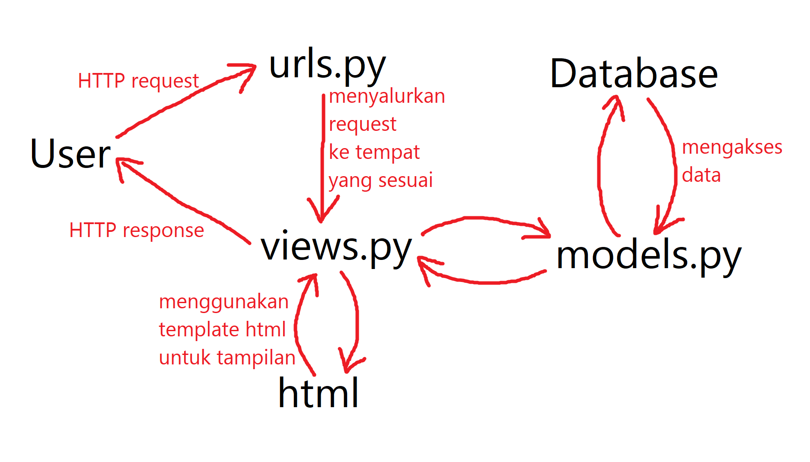

## HTTP Request pada Django

Setiap kali seorang pengguna melakukan HTTP *request* ke *browser* pada *web framework* Django, *request* tersebut akan tersalurkan ke file `urls.py`. Kemudian, `urls.py` akan menyalurkan *request* tersebut ke tempat yang sesuai, hingga sampai ke suatu `views.py`. Setelah mendapat *request*, `views.py` akan memberi *response* yang sesuai dengan menggunakan data pada *database* (melewati `models.py`) dan *template* `html` untuk tampilan pada sisi pengguna. *Response* tersebut akan diproses dan di-*render* oleh *browser* pengguna.

## Virtual Environment

Dalam membuat proyek Django, kita perlu membuat *virtual environment* untuk tempat kita bekerja. Itu digunakan untuk tempat kita meng-*install* dan mengubah semua *dependency* yang diperlukan untuk proyek kita. Setiap proyek berbeda yang kita kerjakan memerlukan *virtual environment*-nya masing-masing. Ini supaya perubahan *dependecy* pada satu proyek tidak akan mempengaruhi atau membuat konflik dengan proyek lain.

## Implementasi

Berikut adalah hal-hal yang saya lakukan pada *template* yang diberikan pada tugas 2 supaya bisa bekerja.
1. Tambahkan `path` baru pada `urls.py` di `project_django` untuk menyalurkan *request* `katalog/` ke folder `katalog`.
2. Tambahkan `path` baru pada `urls.py` di `katalog` untuk menerima *request* tersebut
3. Pada `views.py` di `katalog`, buat fungsi yang menerima *request* dan memberi *response* menggunakan *template* `html` dan data dari *database* melewati `models.py`.
4. Lakukan `makemigrations`, `migrate`, dan `loaddata`.
5. Ubah *template* `html` yang akan diberikan supaya menampilkan data-data yang diberikan `views.py`.
6. *Push* semua perubahan tersebut ke GitHub.
7. Buat aplikasi baru di Heroku.
8. Masukkan API *Key* dan nama aplikasi pada bagian *secrets* di *repository* GitHub.
9. Jalankan *deployment* pada GitHub.