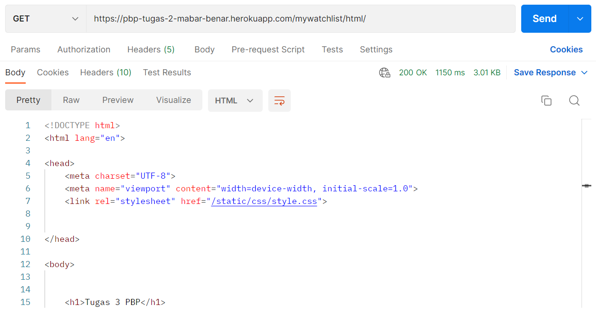
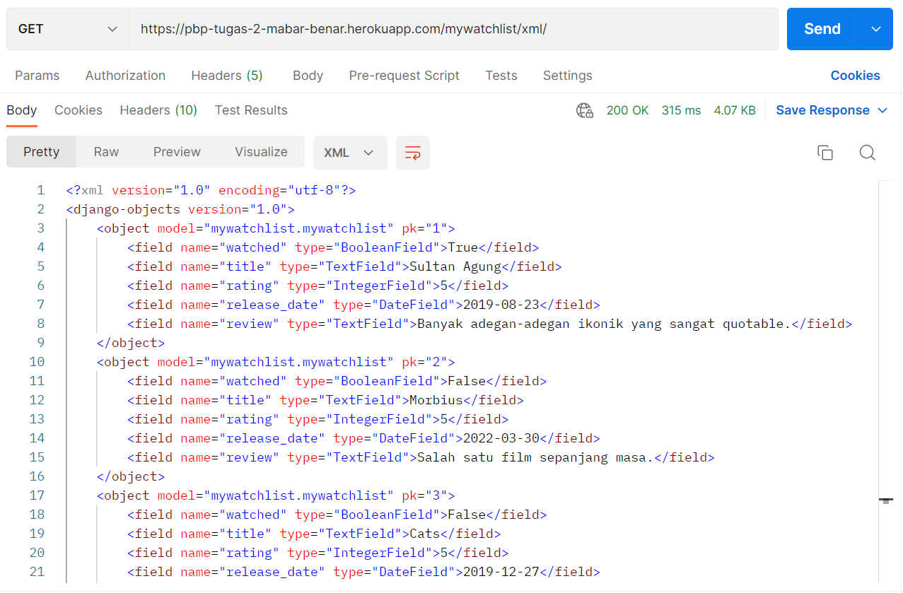
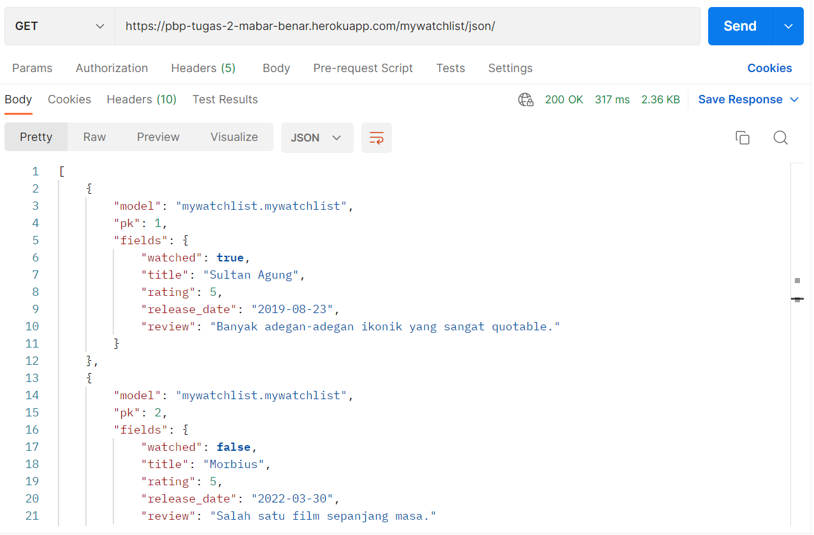

## Perbedaan HTML, XML, dan JSON

### HTML

- Merupakan bahasa *markup*.
- Digunakan untuk ditampilkan pada *browser* web.
- Mendeskripsikan struktur halaman web secara semantik.
- Tersusun atas elemen.
- Setiap elemen memiliki *start tag*, konten, dan *end tag*.
- `<html>` mendefinisikan *root*.
- `<head>` mendefinisikan *metadata* dokumen.
- *Start tag* pada setiap elemen bisa menspesifikasi atribut elemen tersebut.
- Atribut ditulis dalam bentuk `name = "value"`.
- Mengubah *white space* yang berturut-turut menjadi satu *white space* saja.

### XML

- Harus mempunyai elemen *root*.
- Terdapat prolog yang bersifat opsional yang berada di paling awal dokumen.
- Semua elemen mempunyai *closing tag*.
- Prolog tidak mempunyai *closing tag*.
- Setiap *tag* bersifat *case sensitive*.
- Tidak mengubah *white space* yang berturut-turut menjadi satu *white space* saja.
- Lebih sulit dan lebih lambat dari JSON.

### JSON

- Sama dengan kode JavaScript secara *syntax*. *Syntax*-nya diturunkan dari notasi objek pada JavaScript.
- Mudah dikonversi menjadi objek JavaScript.
- Bersifat *text only*.
- Membaca atau menulis data JSON bisa dilakukan oleh bahasa pemrograman apa pun.
- Data berbentuk pasangan-pasangan *name* dan *value*.
- Data diseparasi dengan koma.
- Kurung kurawal berisi objek.
- Kurung siku berisi barisan.
- Lebih mudah dan lebih cepat dari XML.

## Data Delivery

Suatu web bisa bekerja dengan adanya komunikasi antara klien dan server. Itu menggunakan *data delivery*. Itu bisa diselesaikan menggunakan HTML, XML, atau JSON.

## Implementasi

Berikut adalah hal-hal yang saya lakukan pada *template* setelah tugas 2 supaya bisa bekerja.

1. Buat aplikasi baru bernama `mywatchlist` dengan melakukan `startapp`.
2. Tambahkan `path` baru pada `urls.py` di `project_django` untuk menyalurkan *request* `mywatchlist/` ke folder `mywatchlist`.
3. Tambahkan `mywatchlist` pada `INSTALLED_APPS` di *file* `settings.py` yang ada di *folder* `project_django`.
4. Tambahkan `path` baru pada `urls.py` di `mywatchlist` untuk menerima *request* `html/`, `xml/`, dan `json/`.
5. Buat *class* `MyWatchList` pada `models.py` di `mywatchlist`.
6. Buat *file* `initial_mywatchlist_data.json` pada *folder* `fixtures` di `mywatchlist` berisi 10 instansi `MyWatchList`.
7. Lakukan `makemigrations`, `migrate`, dan `loaddata`.
8. Pada `views.py` di `mywatchlist`, buat tiga fungsi untuk masing-masing `path` yang menerima *request* dan memberi *response* menggunakan *template* `html` dan data dari *database* melewati `models.py`.
9. Buat *file* `mywatchlist.html` pada *folder* `templates` yang akan menampilkan data-data yang diberikan `views.py`.
10. Buat `tests.py` pada *folder* `mywatchlist` untuk mengecek apakah masing-masing URL akan menghasilkan `200 OK`.
11. Ubah `Procfile` supaya menjalankan aplikasi `mywatchlist`.
12. *Push* semua perubahan tersebut ke GitHub.
13. Aplikasi Heroku yang dibuat pada tugas 2 akan bisa menjalankan tambahan pada tugas 3.

## Penggunaan Postman

